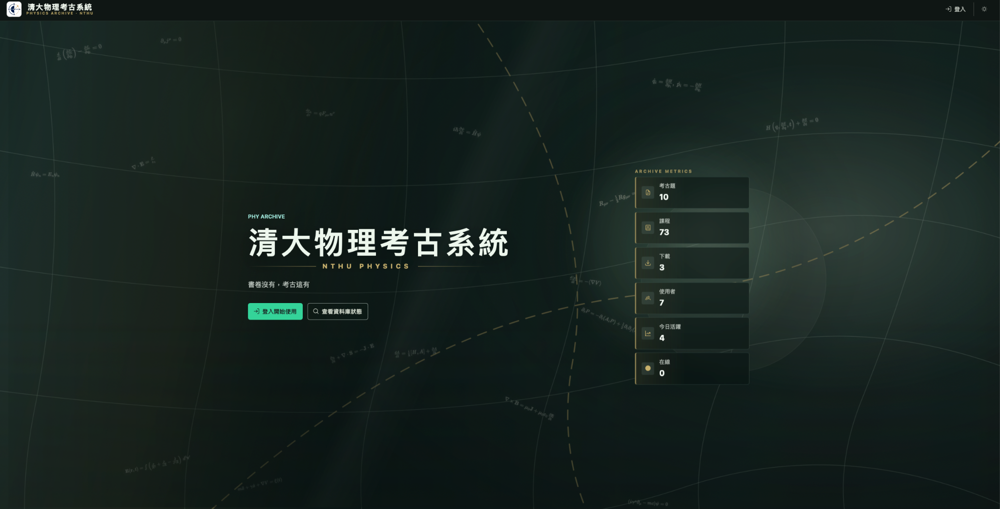
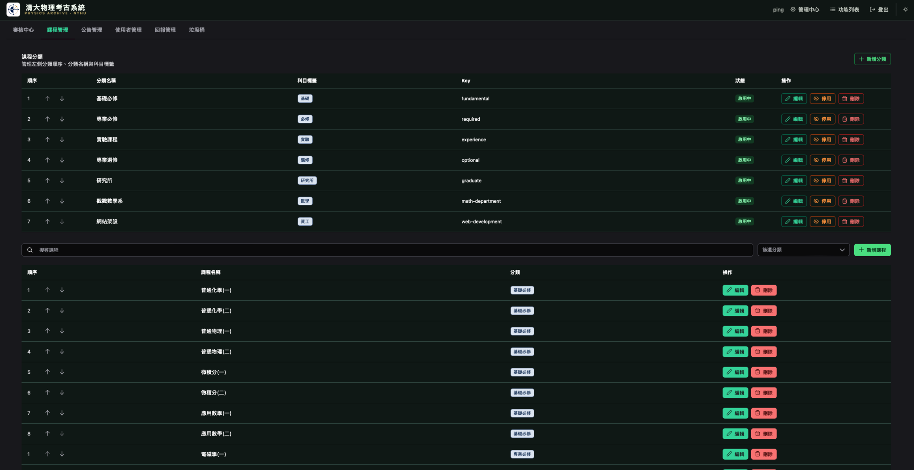
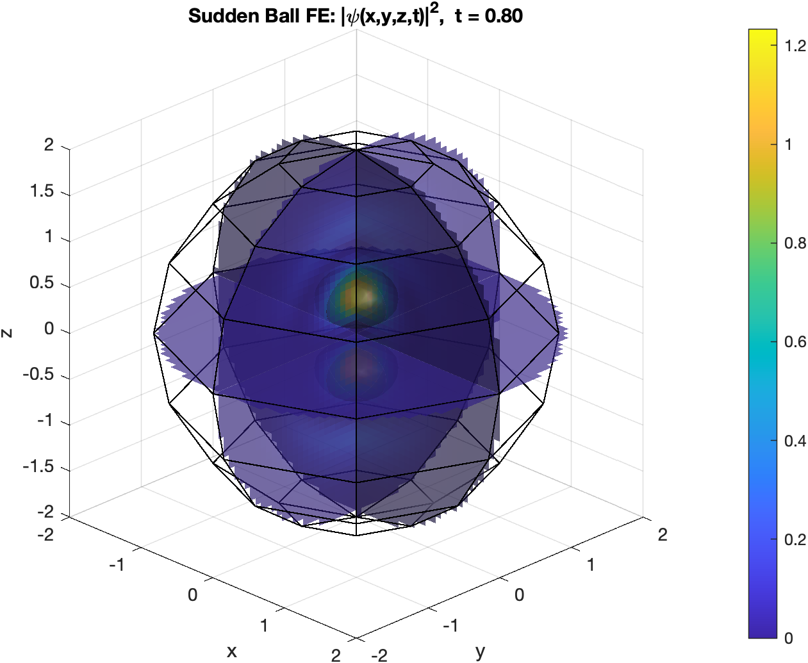
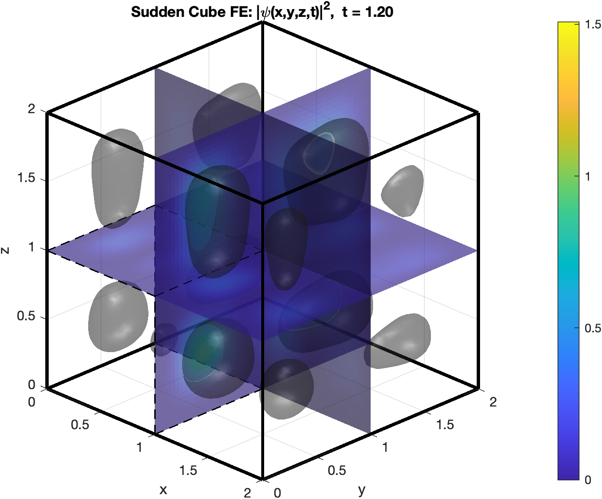

<p align="center">
  
</p>

<p align="center">
  Physics student building simulations, interfaces, and open knowledge systems.
</p>

<p align="center">
  <code>Physics</code>&nbsp;&nbsp;
  <code>Scientific Computing</code>&nbsp;&nbsp;
  <code>Web Development</code>&nbsp;&nbsp;
  <code>Open Source</code>
</p>

---

## 01 / Profile

I study physics at **National Tsing Hua University** and build projects at the intersection of quantum mechanics, numerical simulation, and full-stack web development.

```text
Physics         → understand the system
Computation     → simulate the system
Web             → make the system accessible
```

---

## 02 / Selected Work

### NTHU Physics Archive

<sub>FULL-STACK WEB PLATFORM · ACTIVE DEVELOPMENT</sub>

<br />

<picture>
  <source media="(prefers-color-scheme: dark)" srcset="./assets/projects/archive-home-dark.png">
  <source media="(prefers-color-scheme: light)" srcset="./assets/projects/archive-home-light.png">
  
</picture>

A full-stack archive platform for students in the Department of Physics at National Tsing Hua University. It organizes past exams, solutions, and course resources into a searchable system with PDF preview, submissions, discussion, notifications, and administrative workflows.

**Focus**

`Information Architecture` · `Responsive UI` · `PDF Workflow` · `User Contributions` · `Testing & Deployment`

**Stack**

`Vue` · `PostgreSQL` · `Docker` · `GitHub Actions` · `Playwright`

[Repository →](https://github.com/PingScientist/PastExamWeb_PHY)

<!-- Optional secondary screenshot. Remove this comment block when needed.
<picture>
  <source media="(prefers-color-scheme: dark)" srcset="./assets/projects/archive-admin-dark.png">
  <source media="(prefers-color-scheme: light)" srcset="./assets/projects/archive-admin-light.png">
  
</picture>
-->

---

### Quantum Dynamics in a Moving 3D Infinite Potential Well

<sub>MATLAB · QUANTUM DYNAMICS · SCIENTIFIC VISUALIZATION</sub>

<br />

<table>
  <tr>
    <td width="50%">
      
    </td>
    <td width="50%">
      
    </td>
  </tr>
</table>

A MATLAB study of quantum evolution in expanding **spherical and cubic three-dimensional infinite potential wells**, covering ground states and representative first excited states.

The simulations compare three boundary protocols:

- **Adiabatic expansion** — the state follows the corresponding instantaneous eigenstate.
- **Sudden expansion** — one projection produces fixed mode mixing followed by interference.
- **Finite-speed moving boundaries** — repeated phase evolution and projection continuously connect the two limits.

**Focus**

`Time-Dependent Quantum Mechanics` · `Basis Projection` · `Mode Mixing` · `Energy Evolution` · `3D Visualization`

**Tools**

`MATLAB` · `Numerical Methods` · `Scientific Visualization`

<!-- Replace the placeholder below after publishing the MATLAB repository. -->

---

## 03 / Current Direction

- Improving the NTHU Physics Archive as a reliable student platform
- Exploring time-dependent quantum systems and numerical visualization
- Learning testing, deployment, and maintainable full-stack architecture
- Turning complicated information into clear and usable interfaces

---

## 04 / Contact

<div align="center">

  

  <p>
    <strong>Let’s connect.</strong><br>
    Physics, scientific computing, web development,<br>
    and projects at the intersection of them.
  </p>

  <p>
    <a href="https://github.com/PingScientist"></a>
    &nbsp;
    <a href="mailto:clpinkhgm@gmail.com"></a>
  </p>

  <sub>Open to conversations about physics, simulation, interface design, and open-source projects.</sub>

</div>

---

<!-- ============================================================
FUTURE PROJECT AREA

Duplicate the block below only after a project is ready to publish.
Nothing inside this comment is visible on the GitHub profile.

### Project Name

<sub>CATEGORY · STATUS</sub>

<picture>
  <source media="(prefers-color-scheme: dark)" srcset="./assets/projects/project-dark.png">
  <source media="(prefers-color-scheme: light)" srcset="./assets/projects/project-light.png">
  
</picture>

One concise paragraph explaining what the project does and why it matters.

**Focus**

`Topic A` · `Topic B` · `Topic C`

**Stack**

`Tool A` · `Tool B` · `Tool C`

[Repository →](PROJECT_URL)
============================================================ -->
